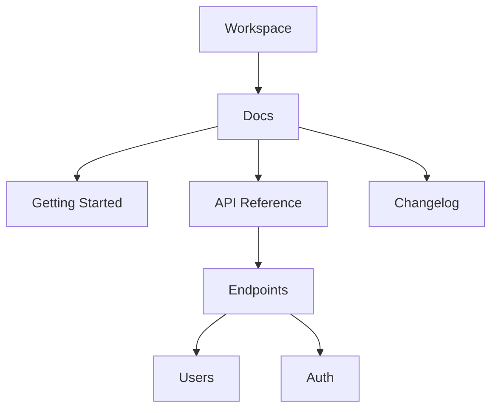

## Overview

Ashfaq afr provides powerful tools to structure, collaborate on, search, and track changes in your documentation. You organize content into intuitive hierarchies, invite team members for real-time editing, perform advanced searches, and maintain version history for reliable workflows.

<Columns cols={3}>
  <Card title="Document Hierarchies" icon="layers" href="#document-structuring">
    Build nested folder structures for organized knowledge bases.
  </Card>
  <Card title="Collaboration" icon="users" href="#collaboration">
    Edit documents together with comments and approvals.
  </Card>
  <Card title="Search & History" icon="search" href="#search">
    Find content instantly and revert changes easily.
  </Card>
</Columns>

## Document Structuring and Hierarchies

Create scalable documentation with nested pages and folders. You define hierarchies using a simple tree structure, making navigation intuitive for users.



Use the dashboard at `https://dashboard.example.com/docs` to drag-and-drop pages into folders. This ensures logical organization, such as grouping API endpoints under references.

<Callout kind="tip">
  Start with a flat structure and nest as your docs grow to avoid overwhelming new contributors.
</Callout>

## Collaboration and Editing Workflows

Invite teammates to co-edit documents in real time. You assign roles like editor or viewer, add inline comments, and use approval workflows for changes.

<Steps>
  <Step title="Invite Collaborators" icon="users">
    Navigate to document settings and add emails.
  </Step>
  <Step title="Real-Time Edits" icon="edit-3">
    Multiple users edit simultaneously with cursor indicators.
  </Step>
  <Step title="Review Changes" icon="eye">
    Use the review panel to approve or reject edits.
  </Step>
</Steps>

## Search Functionality

Ashfaq afr's search scans full-text across all documents, including titles, content, and metadata. You refine results with filters for folders, tags, or dates.

<Tabs>
  <Tab title="Basic Search" icon="search">
    Enter keywords in the top bar to get instant matches.
  </Tab>
  <Tab title="Advanced Filters" icon="filter">
    Combine terms: `tag:api AND folder:reference`.
  </Tab>
</Tabs>

Example query via API:

<CodeGroup tabs="JavaScript,cURL">
  ```javascript
  const response = await fetch('https://api.example.com/v1/search?q=authentication', {
    headers: { Authorization: `Bearer ${YOUR_API_KEY}` }
  });
  const results = await response.json();
  console.log(results.documents);
  ```
  ```bash
  curl -H "Authorization: Bearer YOUR_API_KEY" \
       "https://api.example.com/v1/search?q=authentication"
  ```
</CodeGroup>

## Version History Tracking

Track every change with automatic versioning. You view diffs, restore previous versions, or compare branches.

<ParamField path="docId" param-type="string" required="true">
  Document identifier for history queries.
</ParamField>

<ParamField header="Authorization" param-type="string" required="true">
  Bearer token for authenticated access.
</ParamField>

Retrieve history:

<Response tabs="200">
```json
{
  "versions": [
    {
      "id": "v1.2",
      "date": "2024-10-15T10:00:00Z",
      "author": "user@example.com",
      "changes": "Added authentication section"
    }
  ]
}
```
</Response>

<Expandable title="Advanced Version Compare" default-open="false">
  Use the UI diff viewer or API to merge changes from branches.
</Expandable>

<Columns cols={2}>
  <Card title="Quickstart" icon="rocket" href="/quickstart">
    Set up your first workspace.
  </Card>
  <Card title="API Reference" icon="code" href="/authentication">
    Integrate programmatically.
  </Card>
</Columns>